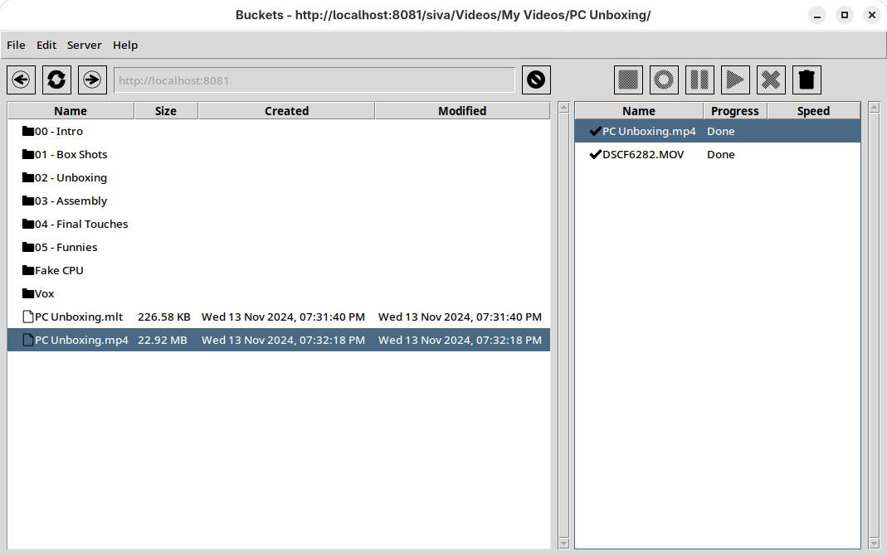

# Buckets
An HTTP based file sharing application written in Python.



The server application provides access to files and directories (folders) on
a machine to anybody that can connect to it. No passwords or other
authentication are required.

The client is used to view and download files.

## Installation
To try Buckets:

1. Get a copy from the
   [releases](https://github.com/sivasankarankb/buckets/releases) page.
   
2. Extract the code wherever you want.

3. Install [Python 3.x](https://www.python.org) if you're on Windows or macOS.
   Windows users must enable the _Add Python to PATH_ setup option.

4. To keep things clean, create a
   [virtual environment](https://packaging.python.org/en/latest/guides/installing-using-pip-and-virtual-environments/#creating-a-virtual-environment)
   with `venv` and enter it.

5. Get the packages required by Buckets by running
   `pip3 install -r requirements.txt` inside the code directory from a terminal.

## Setting up file sharing
Sharing is done by allowing access to a directory on the computer.
Open the `buckets_server.py` file. This contains code of the server.
Edit the line that says `shares = { ... }`.

__Linux (Unix) sharing examples:__

Suppose you want to add `/home/user/` with the share name `files`:

```python
shares = {'files': '/home/user/'}
```

Let's add `/var/www/html` under the name `mirror` to this:

```python
shares = {
     'files': '/home/user/',
     'mirror': '/var/www/html/'
}
```

__Windows sharing example:__

Suppose you want to share the E Drive and your Downloads folder:

```python
shares = {
    'e_drive': 'E:\\',
    'downloads': 'C:\\Users\\Me\\Downloads\\'
}
```

Note the __double backslashes__ used inside the paths.

## Running the server

Do `python3 buckets_server.py` to run the server app on its own. You can also
control the server from the _Server_ menu in the client.

## Running the client

1. Do `python3 app.py`.

2. Set up the Download directory by going to _Preferences_.

3. Type in the IP address and port of the server machine. The address format
   is `http://ipaddress:portnumber`. The default port is `8080`.

4. Double click on a file to download it.
